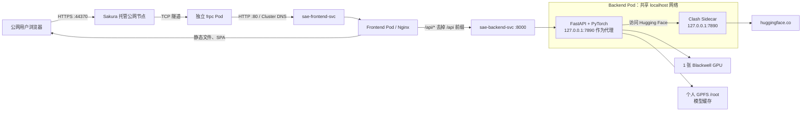

# SAE Web 从本地源码到 GPU 公网服务：容器化与部署白皮书

> 文档版本：1.0
> 编写日期：2026-07-15
> 适用仓库：`Sparse_autoencoder_web`
> 已验证平台：macOS 构建端、Linux/AMD64 Kubernetes、RTX PRO 6000 Blackwell、Harbor、Helm、Sakura Frp
> 当前生产原则：1 张独占 GPU、1 个后端副本、生产禁止 mock fallback、模型首次使用时下载到个人持久化 `/root`

本文是一份从“本机能看源码”走到“外部用户能通过 HTTPS 使用 GPU 推理”的完整教程，
也是本项目部署过程的工程复盘。读者不需要预先掌握 Docker、Kubernetes、CUDA 或
React；遇到术语时，本文会先用简单语言解释，再给出实际文件和命令。

本文不会记录任何真实密码、HF Token、Sakura 访问密钥、Clash 订阅地址或 TLS
私钥。所有 `<...>` 都是必须由操作者替换的占位符，不能原样执行。

## 目录

1. 总介概括：最终架构、步骤和当前状态
2. 基础术语：Docker、Kubernetes、Helm、GPU、网络
3. 源码结构、代码作用与规范
4. 本地开发与代码自检
5. 镜像设计与体积优化
6. Mac 构建 Linux/AMD64 并推送 Harbor
7. Kubernetes 与 Helm 准备
8. Backend Pod：Clash、GPFS 与模型下载
9. 前后端连接和 Service DNS
10. GPU、CUDA 与 Blackwell 适配
11. 完整上线执行清单
12. Sakura Frp 公网上线
13. 最终验收标准
14. 全部故障复盘
15. 日常发布、升级与回滚
16. 多用户、并发与容量
17. 安全规范
18. 排障决策树
19. 安全修改代码和增加模型
20. 命令速查与交接清单

---

# 第一章 总介概括

## 1.1 最终交付了什么

这个项目最终交付的是一个“前端网页 + GPU 推理后端 + 外网代理 + 公网隧道”的
系统：

- 用户在 React 网页输入文本，并选择 1～3 个语言模型/SAE 配置；
- 前端把请求发送到同域名下的 `/api/analyze`；
- 前端 Nginx 把 `/api/*` 转发给 Kubernetes 内部的 FastAPI Service；
- FastAPI 使用 PyTorch、TransformerLens/Hugging Face 和 SAELens 在 GPU 上执行；
- 模型权重第一次使用时经 Clash 下载，以后从个人 GPFS 持久缓存读取；
- Sakura Frp 把仅在集群内可访问的前端 Service 安全转发到公网 HTTPS 地址。

当前已验证的主要产物如下：

| 组件 | 已验证版本/名称 | 作用 |
|---|---|---|
| 前端镜像 | `sae-frontend:v1.0.0` | Nginx 托管 Vite 静态文件，并代理 `/api` |
| 共享 ML Runtime | `sae-ml-runtime:torch2.7.1-cuda12.8-sae6-v2` | PyTorch、CUDA 12.8、cuDNN 9、SAELens 6/Transformers 5 |
| 后端镜像 | `sae-backend:v1.1.0-sae6` | FastAPI 业务源码，支持 Blackwell `sm_120` 与 Qwen 3.5 |
| Clash 镜像 | `clash:verified-amd64-v1` | 后端 Pod 的外网代理 Sidecar |
| frpc 镜像 | `sae-sakura-frpc:0.51.0-sakura-13-amd64-v1` | Sakura 公网隧道客户端 |
| Helm Release | `sae-web` / namespace `gufy` | 管理前端、后端、Service、Clash ConfigMap |
| GPU | `nvidia.com/gpu: "1"` | 后端独占 1 张 RTX PRO 6000 Blackwell |
| 模型缓存 | `/root/.cache/huggingface` | 位于个人 GPFS PVC，Pod 重建后仍可复用 |
| 公网地址 | `https://www-api-map.h5f99e4e0.nyat.app:44370` | Sakura TCP + 自动 HTTPS |

## 1.2 最终架构



需要特别理解两个不同的网络辅助容器：

1. **Clash Sidecar** 位于 backend Pod 内，解决后端访问 Hugging Face 外网的问题；
2. **frpc Pod** 是单独的 Deployment，解决公网用户访问集群内前端的问题。

二者方向相反，不能混为一谈：Clash 是“向外访问”，FRP 是“让外面访问进来”。

## 1.3 浏览器请求的执行逻辑

```text
浏览器 GET /
→ Sakura TCP 隧道
→ sae-frontend-svc:80
→ Nginx 返回 index.html、JS、CSS

浏览器 POST /api/analyze
→ Sakura TCP 隧道
→ sae-frontend-svc:80
→ frontend Nginx
→ proxy_pass http://sae-backend-svc:8000/
→ FastAPI 实际收到 POST /analyze
→ 依次加载所选模型与 SAE
→ GPU 执行激活提取和 SAE 编码
→ JSON 返回浏览器
```

Nginx 配置中的 `proxy_pass` 结尾带 `/`，所以 `/api/analyze` 会变成后端的
`/analyze`。这不是错误，而是有意设计。

## 1.4 从源码到上线的总步骤

整个交付过程按以下顺序执行：

1. **代码适配**：移除硬编码域名；配置 Vite 环境变量；后端监听 `0.0.0.0`；
   模型缓存路径从 `MODEL_PATH` 读取。
2. **本地检查**：修复 npm lock 文件、Python 依赖冲突和 API 请求结构。
3. **镜像分层**：前端使用多阶段构建；后端把巨大 CUDA/ML 环境与业务代码拆开；
   Clash 单独构建。
4. **跨平台构建**：在 Mac 上使用 Buildx 明确构建 `linux/amd64`。
5. **推送 Harbor**：runtime → backend → frontend/Clash，全部使用不可变 Tag。
6. **准备 Kubernetes**：确认 namespace、PVC、Harbor Secret、HF Secret。
7. **Helm 部署**：渲染、dry-run、安装前后端和 Service。
8. **验证内部链路**：PVC、Clash、Hugging Face、CUDA、Service、真实 GPU 推理。
9. **公网接入**：Sakura 创建 TCP 隧道；frpc 作为独立 Pod 访问前端 Service。
10. **最终验收**：可信 HTTPS、React、`/api/`、真实 `/api/analyze` 全部成功。

这套顺序的核心思想是“逐层验证”：先证明应用和 GPU 正常，再增加公网网络层。
如果直接把所有层一次性接起来，出现 404、502 或超时时很难判断错误在哪一层。

## 1.5 当前线上状态

截至本文编写时：

- Helm Release `sae-web` 状态为 `deployed`，Revision 5；
- frontend Pod `1/1 Running`、backend Pod `2/2 Running`、frpc Pod `1/1 Running`；
- 三者均为零重启；
- backend 实测 RAM 当前约 5.6 GiB，历史峰值约 5.6 GiB，上限 200 GiB；
- backend 日志确认 Torch 2.7.1/cu128、Blackwell `sm_120`、真实 CUDA 矩阵运算；
- 公网 `/api/analyze` 使用 `gpt2-small-l11` 在约 8 秒内返回 HTTP/2 200；
- 生产配置 `ALLOW_MOCK_FALLBACK=false`，真实失败不会伪装成模拟成功；
- 旧手工 Ingress 已备份并删除，当前公网流量不依赖 Ingress。

## 1.6 文档之间的关系

从现在开始，文档优先级如下：

1. `SAE_WEB_DEPLOYMENT_WHITEPAPER.md`：完整原理、从零复刻、故障复盘，主文档；
2. `charts/sae-web/DEPLOYMENT.md`：日常照着执行的精简 Helm 操作清单；
3. `ingress_frp_plan.md`：Sakura、Ingress、正式域名的网络专项手册；
4. `deploy_fix.md`：Blackwell CUDA 临时热修到正式镜像的历史记录；
5. `sae-demo-deploy.yaml`：已弃用历史文件，禁止再次 `kubectl apply`。

---

# 第二章 基础术语：先看懂这些词

## 2.1 Docker 相关

**镜像（Image）**：可以理解为只读的软件安装包，里面有程序、依赖和启动命令。

**容器（Container）**：镜像真正运行后的进程。镜像像 Java 的 class/jar，容器更像
启动后的 JVM 进程，但容器还带有独立文件系统和网络隔离。

**Dockerfile**：制作镜像的步骤清单。

**构建上下文（Build Context）**：执行 `docker build` 时允许 Docker 看到的目录。
`.dockerignore` 用来阻止模型、密钥、缓存等无关内容进入构建上下文。

**多阶段构建（Multi-stage Build）**：先用较大的编译镜像生成产物，再把产物复制到
很小的运行镜像。前端最终镜像不需要 Node/npm，只需要 Nginx 和 `dist`。

**镜像层（Layer）**：Dockerfile 每个主要步骤形成的可缓存数据层。把 CUDA 大依赖
单独做成 runtime 后，改一行 Python 业务代码不必重新上传数 GB CUDA 层。

**Tag**：镜像的人类可读版本名，例如 `v1.1.0-sae6`。不要反复覆盖同一个 Tag。

**Digest**：镜像内容的 SHA256 指纹。内容不变，digest 就不变，比 Tag 更严格。

## 2.2 Kubernetes 相关

**Pod**：Kubernetes 最小运行单位。一个 Pod 可以有多个容器，它们共享网络和
`localhost`，但不自动共享文件；共享文件必须挂载 Volume。

**Sidecar**：与主容器放在同一 Pod 的辅助容器。本项目的 Clash 就是 Sidecar。

**Deployment**：管理 Pod 数量、升级和重建的控制器。Pod 被删除后，Deployment 会
自动创建新的 Pod。

**Service**：给一组可能随时换 IP 的 Pod 提供稳定名字和虚拟 IP。本项目使用
`sae-backend-svc` 和 `sae-frontend-svc`。

**ClusterIP**：只能在集群内部访问的 Service 类型。它不会直接把端口暴露到公网。

**ConfigMap**：保存非加密文本配置的 Kubernetes 对象。它可以被挂载成容器文件。

**Secret**：保存 Token、密码等敏感值的对象。默认 Base64 只是编码，不等于加密，
仍需依靠 RBAC 限制读取权限。

**PVC（PersistentVolumeClaim）**：Pod 对持久存储的申请/引用。Pod 重建后仍能重新
挂载同一个存储，因此模型缓存不随容器消失。

**emptyDir**：属于 Pod 的临时目录。容器重启保留，Pod 删除/重新调度后消失。

**Probe（探针）**：Kubernetes 判断程序是否启动、是否就绪、是否仍健康的检查。

**namespace**：Kubernetes 中的逻辑隔离空间。本项目使用 `gufy`。

## 2.3 Helm 相关

**Helm**：Kubernetes 的模板和版本管理工具，类似“带变量的 YAML 安装器”。

**Chart**：一套 Helm 模板，本项目位于 `charts/sae-web`。

**values.yaml**：模板变量，例如镜像 Tag、CPU、内存、GPU、PVC 名称。

**Release**：Chart 安装到集群后的一个实例，本项目名为 `sae-web`。

**dry-run**：只渲染/检查，不真正修改集群。正式部署前必须先执行。

## 2.4 GPU 相关

**CPU RAM**：普通内存。本项目 backend 上限为 200 GiB。

**GPU VRAM/显存**：GPU 自己的内存，与 200 GiB RAM 完全不同。CPU RAM 很空也可能
出现 `CUDA out of memory`。

**CUDA Driver**：安装在 Kubernetes GPU 节点宿主机上的 NVIDIA 驱动。通常不打进
业务镜像。

**CUDA Runtime**：容器中运行 CUDA 程序所需的用户态库。本项目使用 CUDA 12.8。

**cuDNN**：NVIDIA 为神经网络优化的运行库，本项目使用 cuDNN 9。

**Compute Capability / sm_120**：GPU 指令架构代号。RTX PRO 6000 Blackwell 需要
PyTorch 镜像包含 `sm_120` 内核，否则会报 `no kernel image is available`。

## 2.5 网络相关

**反向代理**：客户端只访问 Nginx，由 Nginx 再替客户端访问后端。

**SPA**：单页应用。React 的路由在浏览器处理，Nginx 必须在未知路径返回
`index.html`，否则刷新子路由会 404。

**Ingress**：Kubernetes 内常见的 HTTP/HTTPS 入口路由对象。本项目阶段 A 的公网
链路直接由 FRP 进入 Service，因此当前不需要 Ingress。

**FRP**：内网穿透工具。集群内的 `frpc` 主动连接公网 Sakura 节点，使公网用户能
访问原本只有集群内部可见的 Service。

---

# 第三章 源码结构、代码作用与规范

## 3.1 目录结构

```text
Sparse_autoencoder_web/
├── backend/                         # Python/FastAPI/ML 后端
│   ├── main.py                      # 应用入口、路由、启动期 CUDA 检查
│   ├── pipeline.py                  # 模型激活、SAE 编码、报告生成
│   ├── registry.py                  # 支持的模型、层、SAE 注册表
│   ├── config.py                    # 模型缓存路径和显存清理
│   ├── preprocessing.py             # 中文提示词预处理/翻译
│   ├── neuronpedia.py               # 可选概念标签查询
│   ├── requirements-runtime.txt     # 大型 ML 依赖
│   ├── requirements-app.txt         # FastAPI 等轻量依赖
│   ├── Dockerfile.runtime           # 共享 CUDA/ML Runtime
│   └── Dockerfile                   # 后端业务镜像
├── frontend/                        # React/Vite 前端
│   ├── src/App.jsx                  # 页面状态、fetch 请求、结果展示入口
│   ├── src/constants.js             # API_BASE、模型兜底信息、颜色
│   ├── src/components/              # 各种图表和交互组件
│   ├── .env.development             # 本地 API 地址
│   ├── .env.production              # 生产相对路径 /api
│   ├── nginx.conf                   # 静态托管、SPA、/api 反代
│   └── Dockerfile                   # Node 构建 + Nginx 运行
├── clashconfig/                     # 自有 Clash 二进制镜像上下文
├── charts/sae-web/                  # Helm Chart
├── deploy/                          # Sakura frpc 独立 Deployment/脚本
├── ingress_frp_plan.md              # 网络专项手册
└── SAE_WEB_DEPLOYMENT_WHITEPAPER.md # 本白皮书
```

## 3.2 后端代码的职责边界

### `main.py`

只负责 Web 层：

- 探测 Torch、TransformerLens、SAELens、Transformers 是否能 import；
- 在生产启动时验证 CUDA、GPU 架构和真实矩阵运算；
- 定义 `GET /`、`GET /models`、`POST /analyze`；
- 使用 Pydantic 限制 prompt、模型数量和 `top_k`；
- 把真正的分析工作交给 `pipeline.py`。

`AnalyzeRequest` 的边界：

```text
prompt: 1～2048 字符
selected_models: 1～3 个
top_k: 1～50
```

这些限制既是接口契约，也是最基础的资源保护。

### `pipeline.py`

负责真正的模型分析：

1. 从 registry/SAE cfg 解析模型配置；
2. 优先走 TransformerLens Path A；
3. Path A 不兼容时走 Hugging Face forward hook Path B；
4. 加载 SAE，检查激活维度是否等于 `d_in`；
5. `SAE.encode()` 生成稀疏特征；
6. 构建全局特征、逐 Token 特征和可视化数据；
7. 删除模型/SAE 对象并清理 CUDA cache。

所选模型按顺序 hot-swap，不同时装入显存。这是单 GPU 稳定性的关键。

### `registry.py`

这是新增模型的主要入口。每个条目明确：显示名、基座模型、SAE release、SAE ID、
hook 层和中文输入策略。模型配置必须与 SAE 训练时的激活维度一致。

### `config.py`

读取 `MODEL_PATH`，默认回退到 `/root/.cache/huggingface`；同时在导入 Hugging Face
库之前设置缓存环境变量，避免不同库各自写到不同目录。

### `preprocessing.py`

按 registry 元数据判断中文是否需要翻译。翻译模型默认跑 CPU，避免长期占用主分析
GPU 显存。翻译模型也使用同一个 Hugging Face 缓存目录。

## 3.3 前端代码的职责

`App.jsx` 使用浏览器原生 `fetch`：

```javascript
const res = await fetch(`${API_BASE}/analyze`, {
  method: 'POST',
  headers: { 'Content-Type': 'application/json' },
  body: JSON.stringify({ prompt, selected_models: modelKeys, top_k: topK }),
});
```

本项目继续使用 `fetch`，没有必要为了简单请求增加 Axios：

- `fetch` 是浏览器内置，无额外依赖；
- Axios 的优势是拦截器、统一超时、请求取消和自动 JSON 转换；
- 如果未来有登录 Token、刷新 Token、复杂错误拦截，再统一封装 Axios 客户端；
- 无论用哪一个，请求地址都必须来自 `VITE_API_BASE_URL`，不能硬编码域名/IP。

`constants.js` 的核心写法：

```javascript
export const API_BASE = import.meta.env.VITE_API_BASE_URL || '/api';
```

含义是：有环境变量就使用；没有就安全回退到同源 `/api`。

## 3.4 代码格式与工程规范

### Python

- 使用 4 空格缩进；
- 路由、业务逻辑、模型注册分文件；
- 环境变量使用大写蛇形命名，例如 `MODEL_PATH`；
- 不在源码中写 Token、代理订阅或用户目录绝对地址；
- 捕获异常时保留 traceback，但生产禁止把失败改成假成功；
- GPU 对象必须在 `finally` 中释放，确保异常路径也清理显存。

### JavaScript/React

- 组件使用 PascalCase，例如 `ControlPanel.jsx`；
- 普通变量/函数使用 camelCase；
- API 地址集中在 `constants.js`；
- 生产使用同源相对 URL，浏览器不需要知道 Kubernetes Service；
- `package.json` 与 `package-lock.json` 必须同步，CI/镜像使用 `npm ci`。

### YAML/Helm

- YAML 使用 2 空格缩进，不能用 Tab；
- 镜像、资源、端口写入 `values.yaml`，模板只表达结构；
- Deployment selector 与 Pod label 必须完全一致；
- Secret 只引用名称/键，不把真实值写进 values；
- 所有变更先 `helm lint`、`helm template`、`--dry-run=client`。

### Dockerfile

- 使用 exec 形式的 `CMD ["程序", "参数"]`；
- 大依赖和业务代码分层；
- 安装 Python 包必须带 `--no-cache-dir`；
- 后端每个 Dockerfile 在最后一次 pip install 后必须执行：

```dockerfile
RUN python -m pip uninstall -y torchvision torchaudio \
    && python -m pip check
```

- 模型权重、`.env`、私钥、缓存必须由 `.dockerignore` 排除。

---

# 第四章 本地开发与代码自检

## 4.1 本地环境要求

推荐准备：

```text
Git
Docker Desktop（支持 Buildx）
Node.js 22
npm 10/兼容版本
Python 3.10
kubectl
Helm
```

为什么不是 Node 18：当前 Vite 8 要求 Node `^20.19.0` 或 `>=22.12.0`。最初规划的
`node:18-alpine` 已不兼容，所以正式 Dockerfile 使用 `node:22-alpine`。

## 4.2 前端环境变量

开发文件：

```dotenv
# frontend/.env.development
VITE_API_BASE_URL=http://localhost:8000
```

生产文件：

```dotenv
# frontend/.env.production
VITE_API_BASE_URL=/api
```

Vite 只会把以 `VITE_` 开头的变量编译进浏览器。浏览器代码是公开的，所以绝不能把
密码或 Token 放入 `VITE_*`。

## 4.3 启动前端

```bash
cd frontend
npm install
npm run dev
```

打开 `http://localhost:5173`。修改源码后 Vite 会热更新。

正式构建前执行：

```bash
npm ci --no-audit --no-fund
npm run lint
npm run build
```

`npm install` 用于更新依赖/lock；`npm ci` 用于严格复现 lock。不要在 Dockerfile 中
用 `npm install` 掩盖 lock 不一致，否则每次构建可能解析出不同依赖。

## 4.4 启动后端

完整 ML 依赖很大，Mac 本地主要用于接口和代码检查；真实 CUDA/SAE 路径以 GPU Pod
为准。

```bash
cd backend
python3.10 -m venv .venv
source .venv/bin/activate
python -m pip install --upgrade pip
python -m pip install -r requirements.txt
python main.py
```

容器和 Pod 必须监听：

```python
host="0.0.0.0"
```

`127.0.0.1` 只接受容器自身连接；`0.0.0.0` 才会监听容器全部网卡，让 Docker 端口
映射和 Kubernetes Service 能访问。

## 4.5 本地接口自检

```bash
curl -fsS http://localhost:8000/
curl -fsS http://localhost:8000/models

curl -X POST http://localhost:8000/analyze \
  -H 'Content-Type: application/json' \
  -d '{
    "prompt":"Apple announced a new product.",
    "selected_models":["gpt2-small-l11"],
    "top_k":3
  }'
```

必须查看响应中的 `pipeline_mode`。本地 HTTP 200 不代表真实 GPU 成功；生产要求
`pipeline_mode: real`，并在日志中出现 `[REAL]`。

---

# 第五章 镜像设计：为什么这样拆分

## 5.1 前端多阶段构建

第一阶段 `node:22-alpine`：

1. 只复制 package/lock；
2. 使用 `npm ci` 安装依赖；
3. 复制源码；
4. `npm run build` 生成 `dist`。

第二阶段 `nginx:alpine`：

1. 复制 `nginx.conf`；
2. 只从上一阶段复制 `dist`；
3. 监听 80。

Node、npm、源码、开发依赖和编译缓存全部不会进入最终镜像。这同时减少体积和攻击面。

## 5.2 Nginx 的三个职责

1. `/assets/`：带哈希资源缓存一年；
2. `/api/`：反向代理到 `sae-backend-svc:8000`；
3. `/`：找不到真实文件时返回 `index.html`，支持 React SPA 刷新。

模型首次加载可能较慢，因此代理读写超时为 600 秒。

## 5.3 后端两层镜像

### 共享 Runtime

基础镜像：

```text
pytorch/pytorch:2.7.1-cuda12.8-cudnn9-runtime
```

它包含：Torch、CUDA Runtime、cuDNN、TransformerLens、SAELens、Transformers。
使用 runtime 而不是 devel，是因为本项目不在容器中编译 CUDA 算子，不需要 nvcc。

### 应用镜像

应用镜像 `FROM` 共享 Runtime，只安装 FastAPI 等小依赖，再复制源码。修改 API 时只
需要推送较小的上层，Harbor 和节点可以复用 CUDA 大层。

## 5.4 为什么镜像中绝不能包含模型

- 权重可能是数 GB 到数十 GB，导致构建、上传和拉取极慢；
- 每次模型更新都要重建镜像；
- 权重与代码生命周期不同；
- gated 模型可能受许可证约束；
- Kubernetes 已提供持久 `/root`，运行时缓存更合理。

因此权重第一次使用时下载到：

```text
/root/.cache/huggingface
```

后续直接读缓存。

## 5.5 Clash 镜像

自有 Clash 镜像使用 Ubuntu 22.04，保留 curl、dig、ping、nc、ps、jq 等工具，方便
现场排障。镜像包含：

- 已验证的 Linux AMD64 `clash` 二进制；
- 非敏感 `Country.mmdb`；
- 不包含真实 `config.yaml`。

真实代理配置由 Helm 在部署时注入，镜像因此可以重复使用。

## 5.6 `.dockerignore` 的作用

后端排除：

- `.env`、虚拟环境、Python 缓存；
- Hugging Face cache、`*.safetensors`、`*.bin` 等权重；
- 未使用的大型概念反向映射；
- TLS 私钥/证书。

前端排除：`node_modules`、`dist`、开发环境文件、日志和证书。

根目录额外排除 `sae-web-tls/`，防止未来从根目录构建时把私钥发送给 BuildKit。

---

# 第六章 在 Mac 上构建 Linux/AMD64 镜像并推送 Harbor

## 6.1 为什么必须显式指定平台

Mac 可能是 Apple Silicon（ARM64），Kubernetes 节点是 AMD64。如果直接 `docker
build`，镜像可能在 Mac 能运行、到 Linux 节点却报 `exec format error`。

所有生产构建必须包含：

```text
--platform linux/amd64
```

## 6.2 变量与 Harbor 登录

```bash
cd /path/to/Sparse_autoencoder_web

export REGISTRY='harbor.aixiongan.org.cn:9443'
export PROJECT='saeweb'

export RUNTIME_IMAGE="$REGISTRY/$PROJECT/sae-ml-runtime:torch2.7.1-cuda12.8-sae6-v2"
export BACKEND_IMAGE="$REGISTRY/$PROJECT/sae-backend:v1.1.0-sae6"
export FRONTEND_IMAGE="$REGISTRY/$PROJECT/sae-frontend:v1.0.0"
export CLASH_IMAGE="$REGISTRY/$PROJECT/clash:verified-amd64-v1"

echo "$RUNTIME_IMAGE"
echo "$BACKEND_IMAGE"
echo "$FRONTEND_IMAGE"
echo "$CLASH_IMAGE"
```

输出必须以完整 Harbor 域名开头。若出现 `/saeweb/...`，说明 registry 变量为空。

登录：

```bash
export HARBOR_USERNAME='<Harbor用户名>'
read -s HARBOR_PASSWORD
printf '%s' "$HARBOR_PASSWORD" | docker login "$REGISTRY" \
  --username "$HARBOR_USERNAME" --password-stdin
unset HARBOR_PASSWORD
```

## 6.3 Buildx Builder

首次创建：

```bash
docker buildx create \
  --name sae-amd64-builder \
  --driver docker-container \
  --use
docker buildx inspect --bootstrap
```

以后复用：

```bash
docker buildx use sae-amd64-builder
docker buildx inspect --bootstrap
```

## 6.4 构建顺序

顺序必须是 Clash、Runtime、Backend、Frontend；其中 Backend 必须等 Runtime 已推送。

```bash
docker buildx build \
  --platform linux/amd64 \
  --provenance=false \
  --sbom=false \
  -f clashconfig/Dockerfile \
  -t "$CLASH_IMAGE" \
  --push \
  clashconfig

docker buildx build \
  --builder sae-amd64-builder \
  --platform linux/amd64 \
  --provenance=false \
  --sbom=false \
  --progress=plain \
  -f backend/Dockerfile.runtime \
  -t "$RUNTIME_IMAGE" \
  --push \
  backend

docker buildx build \
  --builder sae-amd64-builder \
  --platform linux/amd64 \
  --provenance=false \
  --sbom=false \
  --progress=plain \
  -f backend/Dockerfile \
  --build-arg ML_RUNTIME_IMAGE="$RUNTIME_IMAGE" \
  -t "$BACKEND_IMAGE" \
  --push \
  backend

docker buildx build \
  --platform linux/amd64 \
  --provenance=false \
  --sbom=false \
  -f frontend/Dockerfile \
  -t "$FRONTEND_IMAGE" \
  --push \
  frontend
```

Harbor 曾对 Buildx provenance/attestation manifest 返回 `content digest ... not found`，
因此本项目明确关闭 provenance 和 SBOM 附加清单。关闭它们不改变业务镜像平台和
内容，只避免旧 Harbor/代理对附加 manifest 兼容不良。

## 6.5 检查平台

```bash
docker buildx imagetools inspect "$RUNTIME_IMAGE"
docker buildx imagetools inspect "$BACKEND_IMAGE"
docker buildx imagetools inspect "$FRONTEND_IMAGE"
docker buildx imagetools inspect "$CLASH_IMAGE"
```

每个结果都必须包含 `linux/amd64`。

## 6.6 上行慢或 Push 失败怎么办

大 Runtime 推送几个小时并不罕见。若网络失败：

- 原样重跑同一个命令；
- 不要换 Tag；
- 不要加 `--no-cache`；
- 不要删除 BuildKit builder；
- 不要手工清 Harbor blob。

BuildKit 和 Harbor 会按 digest 复用已上传的层。

---

# 第七章 Kubernetes 与 Helm 准备

## 7.1 平台前提

管理员需要提前提供：

- namespace `gufy`；
- 可用的 NVIDIA 驱动、Container Toolkit 和 device plugin；
- 标签为 `gpu-model=PRO6000` 的 GPU 节点；
- 个人 PVC `pvc-gpfshome-gufy`；
- 拉取 Harbor 的网络权限。

验证：

```bash
kubectl config current-context
kubectl get namespace gufy
kubectl get pvc pvc-gpfshome-gufy -n gufy
kubectl get secret harbor-cred -n gufy
```

PVC 必须是 `Bound`。不存在时 Pod 会 Pending/FailedMount，不会自动改用临时磁盘。

## 7.2 Helm Chart 管理什么

当前基础 Chart 渲染五类资源：

1. Clash ConfigMap；
2. backend Deployment（Clash + Python 两个容器）；
3. backend ClusterIP Service；
4. frontend Deployment；
5. frontend ClusterIP Service。

Ingress 默认关闭；Sakura frpc 是独立 Deployment，不属于 `sae-web` Helm Release。

## 7.3 资源规划

Backend：

```yaml
requests:
  cpu: "16"
  memory: 180Gi
  nvidia.com/gpu: "1"
limits:
  cpu: "32"
  memory: 200Gi
  nvidia.com/gpu: "1"
```

Frontend：50m/1Gi request，500m/2Gi limit。Clash：100m/128Mi request，1 CPU/512Mi
limit。

GPU request 和 limit 必须都是 1，才能由 NVIDIA device plugin 分配同一张独占卡。

## 7.4 Harbor Secret

若 `harbor-cred` 不存在：

```bash
kubectl create secret docker-registry harbor-cred \
  --namespace gufy \
  --docker-server=harbor.aixiongan.org.cn:9443 \
  --docker-username='<用户名>' \
  --docker-password='<密码>'
```

不要把生成的 Secret YAML 提交 Git。

## 7.5 Backend Secret

本地 `backend/.env` 格式：

```dotenv
HF_TOKEN=<HuggingFace访问令牌>
X-API-KEY=<可选Neuronpedia令牌>
```

键名与等号之间不能有空格。错误的 `X-API-KEY =...` 会生成带尾随空格的非法键名。

创建/更新：

```bash
kubectl create secret generic sae-backend-secrets \
  --namespace gufy \
  --from-env-file=backend/.env \
  --dry-run=client -o yaml | kubectl apply -f -

kubectl get secret sae-backend-secrets -n gufy \
  -o go-template='{{range $k,$v := .data}}{{$k}}{{"\n"}}{{end}}'
```

只检查键名，不输出值。HF gated 模型还要求该 Token 所属账户已经在模型页面接受
许可；仅有格式正确的 Token 不代表一定有访问权。

## 7.6 Clash 配置

真实文件：

```text
clashconfig/config.yaml
```

它已被 `.gitignore` 排除。可以从 `clash-config.example.yaml` 复制后填写真实订阅：

```bash
cp clash-config.example.yaml clashconfig/config.yaml
```

不要把 Token 或订阅 URL 放到命令行 `--set`。使用：

```bash
--set-file clash.config.content=./clashconfig/config.yaml
```

Helm 会把文件内容变成 ConfigMap 的 `data.config.yaml`，Kubernetes 再挂载为
`/etc/clash/config.yaml`。ConfigMap 不加密，有更高安全要求时应改为 Secret。

## 7.7 Helm 检查与安装

```bash
helm lint charts/sae-web --strict

helm template sae-web charts/sae-web \
  --namespace gufy \
  --values charts/sae-web/values.yaml \
  --set-file clash.config.content=./clashconfig/config.yaml \
  > /tmp/sae-web-rendered.yaml

kubectl apply --dry-run=server -f /tmp/sae-web-rendered.yaml

helm upgrade --install sae-web charts/sae-web \
  --namespace gufy \
  --values charts/sae-web/values.yaml \
  --set-file clash.config.content=./clashconfig/config.yaml \
  --dry-run=client --debug
```

确认无误后正式安装：

```bash
helm upgrade --install sae-web charts/sae-web \
  --namespace gufy \
  --values charts/sae-web/values.yaml \
  --set-file clash.config.content=./clashconfig/config.yaml \
  --wait \
  --timeout 60m
```

不要同时执行 `kubectl apply -f sae-demo-deploy.yaml`，否则 Helm 和手工 YAML 会争夺
同一资源。

---

# 第八章 Backend Pod 的特殊设计：Clash、GPFS 与模型下载

## 8.1 为什么 Clash 与 backend 放在同一个 Pod

同一个 Pod 内的容器共享网络命名空间，所以：

```text
backend 容器访问 127.0.0.1:7890
等价于访问同 Pod Clash 容器监听的 7890
```

如果 Clash 在另一个 Pod，`127.0.0.1` 就只会指向 backend 自己，代理必然失败。

两个容器虽然共享网络，但文件系统仍然隔离。Clash 配置通过 ConfigMap Volume，
运行数据通过 `emptyDir` 共享/持久到 Pod 生命周期。

## 8.2 Clash 启动文件的来源

```text
clash 二进制        → Clash 镜像 /usr/local/bin/clash
Country.mmdb        → Clash 镜像 /opt/clash/Country.mmdb
config.yaml         → ConfigMap /etc/clash/config.yaml
provider/运行数据   → emptyDir /root/.config/clash
```

`Country.mmdb` 约 6 MiB，超过 ConfigMap 约 1 MiB 限制，因此先烘焙进镜像，再由
`seed-clash-geodata` InitContainer 复制到可写 `emptyDir`。

## 8.3 Clash 探针为什么使用 exec

Clash 安全配置只监听 `127.0.0.1:7890`。Kubernetes `tcpSocket` 探针通常访问 Pod IP，
会把实际正常的 localhost 服务误判为失败。因此探针在容器内部执行：

```bash
nc -z 127.0.0.1 7890
```

这是曾经造成 backend Pod `1/2 Running`、Clash 反复重启的真实问题。

## 8.4 后端代理环境变量

大小写两套都设置，兼容 requests、httpx、Hugging Face 等不同库：

```text
HTTP_PROXY=http://127.0.0.1:7890
HTTPS_PROXY=http://127.0.0.1:7890
http_proxy=http://127.0.0.1:7890
https_proxy=http://127.0.0.1:7890
```

内部地址必须直连：

```text
NO_PROXY=localhost,127.0.0.1,::1,.svc,.k8s.aiplat,.cluster.local,
         kubernetes.default.svc,sae-backend-svc,sae-frontend-svc
```

本平台集群域名实际是 `k8s.aiplat`，不是常见默认值 `cluster.local`。应以 Pod 内
`/etc/resolv.conf` 为准。

## 8.5 Hugging Face 官方端点

正式配置固定：

```text
HF_ENDPOINT=https://huggingface.co
```

HF Token 只应发送给官方域名。Clash 负责网络转发，不改变 HTTPS 目标域名。

## 8.6 第一次下载与后续缓存

Pod 启动不会预下载所有模型。第一次调用某个模型时：

1. FastAPI 根据 registry 得到 Hugging Face 模型/SAE ID；
2. Hugging Face 库发现本地没有缓存；
3. 请求经 `127.0.0.1:7890` 进入 Clash；
4. Clash 转发到 `huggingface.co`；
5. 权重写入 `/root/.cache/huggingface`；
6. 下一次直接读取 GPFS 缓存。

这解释了为什么第一次请求明显更慢，第二次更快。

## 8.7 GPFS 持久化和锁处理

Chart 引用已有 PVC：

```text
pvc-gpfshome-gufy → 挂载到 backend 容器 /root
```

模型权重保存在个人持久空间，不随 backend Pod 重建丢失。

Hugging Face 没有可靠的“完全关闭 filelock”环境变量。GPFS 上直接执行 flock 可能
卡住，所以只把锁目录覆盖为节点本地 `emptyDir`：

```text
权重：/root/.cache/huggingface/hub           → GPFS
锁：  /root/.cache/huggingface/hub/.locks    → emptyDir
```

这样既持久化大权重，又避免在 GPFS 上执行高风险锁操作。

## 8.8 InitContainer 写入检查

`verify-model-storage` 在主服务前创建并删除一个极小文件。若 PVC 名称正确但只读、
权限不足或配额用完，Pod 会在 Init 阶段明确失败，而不是等首次模型下载才暴露问题。

---

# 第九章 前后端如何连接

## 9.1 Kubernetes Service 名称

正式名称：

```text
sae-frontend-svc:80
sae-backend-svc:8000
```

同 namespace 可以使用短名。完整 FQDN 是：

```text
sae-frontend-svc.gufy.svc.k8s.aiplat
sae-backend-svc.gufy.svc.k8s.aiplat
```

不要把 ClusterIP `10.233.x.x` 写入配置。ClusterIP 可用于临时诊断，但 Service 重建
后可能改变；DNS 名称才是稳定接口。

## 9.2 前端为什么只访问 `/api`

生产浏览器访问当前公网域名。若前端写死 `http://backend-ip:8000`，会产生：

- 域名/IP 改动必须重新编译；
- 浏览器跨域 CORS；
- HTTPS 页面访问 HTTP API 的 Mixed Content；
- 后端地址暴露给用户；
- Kubernetes Pod/Service IP 变化导致失效。

使用 `/api` 后，页面和 API 同源，域名和 TLS 只处理一次。

## 9.3 Service 如何找到 Pod

Service 的 selector 与 Pod label 一致：

```text
app.kubernetes.io/instance=sae-web
app.kubernetes.io/component=frontend/backend
```

检查 EndpointSlice：

```bash
kubectl get endpointslice -n gufy \
  -l kubernetes.io/service-name=sae-frontend-svc

kubectl get endpointslice -n gufy \
  -l kubernetes.io/service-name=sae-backend-svc
```

Service 存在但 Endpoint 为空，通常是 selector/label 不匹配或 Pod 未 Ready。

## 9.4 内部链路测试

```bash
FRONTEND_POD="$(kubectl get pod -n gufy \
  -l app.kubernetes.io/instance=sae-web,app.kubernetes.io/component=frontend \
  -o jsonpath='{.items[0].metadata.name}')"

kubectl exec -n gufy "$FRONTEND_POD" -- \
  wget -S -O- http://sae-frontend-svc.gufy.svc.k8s.aiplat/

kubectl exec -n gufy "$FRONTEND_POD" -- \
  wget -S -O- http://sae-frontend-svc.gufy.svc.k8s.aiplat/api/
```

`/api/` 应返回后端 JSON，而不是 React HTML。

## 9.5 port-forward 本地验收

```bash
kubectl port-forward -n gufy service/sae-frontend-svc 8080:80
```

浏览器访问 `http://localhost:8080`，另一个终端：

```bash
curl -fsS http://localhost:8080/api/
curl -fsS http://localhost:8080/api/models
curl -I http://localhost:8080/arbitrary/react/route
```

子路由应返回 200/index.html，而不是 Nginx 404。

---

# 第十章 GPU、CUDA 与 Blackwell 适配

## 10.1 最初为什么失败

旧 Runtime 使用 Torch 2.2.2 + CUDA 12.1。它能看到 RTX PRO 6000，但不包含
Blackwell 所需 `sm_120` CUDA kernel，加载模型时出现：

```text
CUDA error: no kernel image is available for execution on the device
```

“能看到 GPU”不代表“PyTorch 能在这张 GPU 上执行内核”。

## 10.2 正式修复

升级到：

```text
PyTorch 2.7.1
CUDA Runtime 12.8
cuDNN 9
```

该组合实测包含 `sm_120` 并在 Blackwell 上完成真实矩阵乘法、GPT-2、
TransformerLens 和 SAELens。

## 10.3 启动期强制检查

`REQUIRE_CUDA=true` 时，backend 启动会检查：

1. PyTorch 可以 import；
2. `torch.cuda.is_available()` 为 true；
3. 当前 GPU capability 对应架构在 `torch.cuda.get_arch_list()` 中；
4. 在 GPU 上真实执行矩阵乘法并 synchronize。

任何一步失败都会阻止应用正常启动，避免 Pod 看似 Ready、首个用户请求才爆炸。

## 10.4 独立 CUDA 验证

```bash
kubectl exec -n gufy deployment/sae-web-backend -c backend -- python -c \
  "import torch; \
cap=torch.cuda.get_device_capability(0); \
arches=torch.cuda.get_arch_list(); \
print(torch.__version__, torch.version.cuda, torch.cuda.get_device_name(0), cap, arches); \
assert cap == (12, 0); \
assert 'sm_120' in arches; \
x=torch.ones((64,64), device='cuda'); \
y=x@x; torch.cuda.synchronize(); \
print('CUDA_MATMUL_OK', y.shape)"
```

## 10.5 RAM 与显存

Backend 限制的 `200Gi` 是 CPU RAM，不是 GPU 显存。

实测 cgroup：

```text
当前约 5.6 GiB
历史峰值约 5.6 GiB
上限 200 GiB
oom_kill=0
```

因此当前工作负载 CPU RAM 余量很大，但仍可能发生 CUDA 显存 OOM。不要因为给了
200 GiB RAM 就增加多个 Uvicorn worker；每个 worker 可能重复加载模型并争抢同一
GPU。

---

# 第十一章 完整上线执行清单（Golden Path）

本章是从零部署时可以依次打勾的主流程。每一步成功后再进入下一步。

## 11.1 本地代码门禁

- [ ] `frontend/.env.development` 指向 `http://localhost:8000`
- [ ] `frontend/.env.production` 为 `/api`
- [ ] `npm ci`、`npm run lint`、`npm run build` 成功
- [ ] `python -m pip check` 成功
- [ ] backend 监听 `0.0.0.0:8000`
- [ ] 没有 Token、订阅、证书私钥进入 Git

## 11.2 镜像门禁

- [ ] Clash 镜像成功推送
- [ ] Runtime 成功推送
- [ ] Backend 基于该 Runtime 成功推送
- [ ] Frontend 成功推送
- [ ] 四个镜像均为 `linux/amd64`
- [ ] 后端镜像没有模型权重、torchvision、torchaudio

## 11.3 Kubernetes 门禁

- [ ] namespace `gufy` 存在
- [ ] PVC `pvc-gpfshome-gufy` 为 Bound
- [ ] `harbor-cred` 存在
- [ ] `sae-backend-secrets` 含 `HF_TOKEN`，可选含 `X-API-KEY`
- [ ] `clashconfig/config.yaml` 存在且未被 Git 跟踪
- [ ] Helm lint、template、server dry-run、client dry-run 成功

## 11.4 正式安装

```bash
helm upgrade --install sae-web charts/sae-web \
  --namespace gufy \
  --values charts/sae-web/values.yaml \
  --set-file clash.config.content=./clashconfig/config.yaml \
  --wait \
  --timeout 60m
```

观察：

```bash
kubectl get pods -n gufy -w
helm status sae-web -n gufy
```

预期：frontend `1/1`，backend `2/2`。

## 11.5 内部验收

```bash
kubectl logs -n gufy deployment/sae-web-backend -c verify-model-storage --tail=50
kubectl logs -n gufy deployment/sae-web-backend -c clash --tail=200
kubectl logs -n gufy deployment/sae-web-backend -c backend --tail=200

kubectl exec -n gufy deployment/sae-web-backend -c backend -- df -Th /root

kubectl exec -n gufy deployment/sae-web-backend -c backend -- python -c \
  "import requests; r=requests.get('https://huggingface.co', timeout=30); print(r.status_code); r.raise_for_status()"
```

然后 port-forward 执行真实 `/api/analyze`。只有返回 `pipeline_mode: real` 且日志出现
`[REAL]`、`PATH-A`/`PATH-B`、HTTP 200，才算 GPU 后端成功。

---

# 第十二章 Sakura Frp 公网上线

## 12.1 为什么当前不使用 Ingress

平台没有提供可由本 namespace 稳定引用的 Ingress Controller Service/VIP；使用
任意 Node IP 不可靠。Sakura frpc 本身位于集群内，可以直接访问稳定的
`sae-frontend-svc`，所以阶段 A 不需要 Ingress。

这条路径仍然安全地保持 backend 为 ClusterIP；公网只进入 frontend Nginx。

## 12.2 Sakura 面板配置

已验证配置：

```text
隧道 ID: 28213524
名称: sae_web_gufy
类型: TCP
本地 IP: sae-frontend-svc.gufy.svc.k8s.aiplat
本地端口: 80
子域: www-api-map.h5f99e4e0.nyat.app
远程端口: 44370
自动 HTTPS: 自动
```

不要把本地 IP 填成 `127.0.0.1`：frpc 是独立 Pod，它的 localhost 没有 frontend。

## 12.3 frpc 镜像

官方镜像先验证为 Linux/AMD64：

```bash
docker pull --platform linux/amd64 natfrp.com/frpc
docker run --rm --platform linux/amd64 natfrp.com/frpc --version_full
```

已验证版本 `0.51.0-sakura-13`，并同步到 Harbor：

```text
harbor.aixiongan.org.cn:9443/saeweb/sae-sakura-frpc:
0.51.0-sakura-13-amd64-v1
```

Deployment 同时固定 digest：

```text
sha256:9ce27d61c853fdfbbe16b2969fefd7e52aa9bdb041e7f5bff8c4c5c150c5d8e4
```

## 12.4 Sakura Token

Sakura 访问密钥不是 TLS 私钥。正确 Token 是面板“查看访问密钥”得到的一串客户端
凭据，不包含 `BEGIN PRIVATE KEY`。

本地把 Token 放入已忽略文件：

```bash
pbpaste > sae-web-tls/NATFRP_TOKEN
chmod 600 sae-web-tls/NATFRP_TOKEN
```

脚本会去除复制产生的 CR/LF，不会输出 Token：

```bash
./deploy/apply-sakura-frpc.sh
```

脚本会：

1. 创建/更新 `sae-sakura-frpc-credentials` Secret；
2. 固定 `NATFRP_TARGET=28213524`；
3. 应用独立 frpc Deployment；
4. 等待 rollout；
5. 显示不含密钥的日志。

## 12.5 为什么 frpc 只能有一个副本

同一 Sakura 隧道不能被两个客户端重复启动。Deployment 使用：

```yaml
replicas: 1
strategy:
  type: Recreate
```

Recreate 会先停旧 Pod，再建新 Pod，避免 RollingUpdate 短暂产生两个 frpc。

## 12.6 TLS 证书

绑定 `nyat.app` 后，frpc 会先生成临时自签证书，再从 Sakura 服务器加载正式证书。
日志出现以下含义才算成功：

```text
已从服务器为 www-api-map... 加载证书
TCP 隧道启动成功
```

下载到本地的 `.crt/.key` 已验证匹配，但当前自动 HTTPS 不需要手工挂载。手工证书
会过期；让 Sakura 自动下发才能在重启时重新获取。

## 12.7 访问认证与完全公开

开启 Sakura 访问认证时，每个公网 IP 首次访问需输入访问密码/TOTP 或授权。

如果希望所有人无需认证：在 Sakura 面板编辑隧道，清空访问密码/TOTP，再重启：

```bash
kubectl rollout restart deployment/sae-sakura-frpc -n gufy
kubectl rollout status deployment/sae-sakura-frpc -n gufy --timeout 10m
```

关闭认证后，任何人都能匿名调用 `/api/analyze` 占用 GPU。正式公开前应增加应用
登录、任务队列和限流；Sakura Token 只保护 frpc 连接，不是网站用户认证。

## 12.8 公网验收

```bash
curl --fail --silent --show-error --max-time 45 \
  https://www-api-map.h5f99e4e0.nyat.app:44370/api/
```

真实推理：

```bash
curl --fail-with-body --silent --show-error --max-time 600 \
  -H 'Content-Type: application/json' \
  --data '{
    "prompt":"Apple announced the iPhone 18 at WWDC.",
    "selected_models":["gpt2-small-l11"],
    "top_k":3
  }' \
  https://www-api-map.h5f99e4e0.nyat.app:44370/api/analyze \
  -o /tmp/sae-public-result.json
```

必须确认 `metadata.pipeline_mode` 为 `real`。

## 12.9 Ingress 后续路线

如果未来必须使用不带端口的 `https://gufy.aixiongan.org.cn`，再启用
`charts/sae-web/values-ingress.yaml`，并要求管理员提供：稳定 Ingress Controller
地址、IngressClass、TLS Issuer/证书和 DNS 权限。不要用单个 Node IP 代替稳定入口。

---

# 第十三章 最终验收标准

## 13.1 镜像

- 所有镜像为 `linux/amd64`；
- Runtime/Backend/Frontend/Clash Tag 正确；
- frpc 使用 Tag + digest；
- 后端镜像中无模型权重；
- `pip check` 成功，无 torchvision/torchaudio。

## 13.2 Kubernetes

```bash
helm status sae-web -n gufy
kubectl get deployment,pod,svc -n gufy -o wide
```

预期：

```text
sae-web-frontend   1/1 Running
sae-web-backend    2/2 Running
sae-sakura-frpc    1/1 Running
```

## 13.3 存储

```bash
kubectl exec -n gufy deployment/sae-web-backend -c backend -- \
  df -Th /root /root/.cache/huggingface /root/.cache/huggingface/hub/.locks
```

权重目录应位于 GPFS；`.locks` 应显示不同的本地挂载。

## 13.4 Clash 与外网

```bash
kubectl exec -n gufy deployment/sae-web-backend -c clash -- \
  nc -z 127.0.0.1 7890

kubectl exec -n gufy deployment/sae-web-backend -c backend -- env | grep -i proxy
```

后端访问 Hugging Face 返回 200/可接受重定向。

## 13.5 CUDA 与真实 pipeline

日志必须出现：

```text
CUDA validation passed
[REAL | 模型名]
Activation path: transformer_lens 或 huggingface_hook
[SAELens]
POST /analyze ... 200 OK
```

不得出现：

```text
CUDA error
no kernel image
FALLBACK → mock
```

## 13.6 公网

- HTTPS 证书受信任；
- 首页是 React 应用；
- `/api/` 返回后端 JSON；
- SPA 子路由刷新不 404；
- `/api/analyze` 返回 HTTP 200 和 `pipeline_mode: real`；
- 删除旧 Ingress 后仍正常，证明 FRP 直接 Service 链路成立。

---

# 第十四章 全部故障复盘：症状、原因、修复、如何继续

本章记录实际遇到的主要问题。排障时先找最接近的症状，再执行对应“继续流程”。

## 14.1 镜像 Tag 变成 `/saeweb/...`

**症状**：

```text
invalid tag "/saeweb/sae-ml-runtime:...": invalid reference format
```

**原因**：Shell 重开后变量丢失，或把 `REGISTRY` 改名成 `REGISTRY_XIONGAN`，但
`RUNTIME_IMAGE` 仍使用旧变量，导致仓库域名为空。

**修复**：重新导出所有变量并 `echo` 检查完整值。不要只补某一个派生变量。

**继续流程**：重新运行原 buildx 命令，不清缓存。

## 14.2 `transformer-lens==1.18.0` 找不到

**症状**：pip 列表没有 1.18.0。

**原因**：该版本没有可供当前 Python/索引安装的发行包。

**错误尝试**：改成 1.19.0 后又与 `sae-lens 3.22.0` 要求的
`transformer-lens>=2.0.0` 冲突。

**正式修复**：固定 `transformer-lens==2.0.0`，与 SAELens 依赖范围一致。

## 14.3 `ModuleNotFoundError: typeguard`

**原因**：TransformerLens 2.0.0 运行时直接 import `typeguard`，但依赖元数据没有在
该组合中自动带入。

**修复**：`requirements-runtime.txt` 显式添加：

```text
typeguard>=4.2.0,<5.0.0
```

**继续流程**：重跑 Runtime 构建；已完成的基础镜像层会复用。

## 14.4 Backend `pip check` 报 typer 冲突

**症状**：

```text
sae-lens 3.22.0 requires typer<0.13.0,>=0.12.3,
but you have typer 0.26.8
```

**原因**：FastAPI CLI 的传递依赖拉取了新 typer，破坏 Runtime 中 SAELens 的约束。

**修复**：应用依赖显式锁定兼容交集：

```text
typer>=0.12.3,<0.13.0
```

## 14.5 Runtime 推送两小时后 `content digest ... not found`

**原因**：Buildx 生成的 provenance/attestation manifest 与 Harbor/代理兼容不良；
镜像层本身多数已上传。

**修复**：在原命令增加：

```text
--provenance=false --sbom=false
```

**继续流程**：使用同一 Dockerfile、上下文、Tag 重跑；不要改成根目录 `.`，也不要
清缓存。

## 14.6 前端 `npm ci` 报 package-lock 不同步

**症状**：缺少 `@emnapi/core`、`@emnapi/runtime`。

**原因**：`package.json` 与 lock 文件不是同一次 npm 解析结果。

**不推荐修复**：把 Dockerfile 改成 `npm install`。这会掩盖 lock 漂移，降低可复现性。

**正式修复**：在同一项目运行 `npm install` 更新 lock，检查 diff，再保留 Dockerfile
中的 `npm ci`。lock 描述包解析，Mac 生成的 lock 可以供 Linux 安装；原生可选包由
npm 按目标平台选择。

## 14.7 Node 18 与 Vite 8 不兼容

**原因**：Vite 8 的 Node 版本要求已经高于最初设计。

**修复**：前端 builder 使用 `node:22-alpine`，不要为了满足旧要求强行降 Vite 或
忽略 engine 警告。

## 14.8 `X-API-KEY ` 不是合法 Secret 键

**症状**：

```text
"X-API-KEY " is not a valid key name
```

**原因**：`.env` 写成 `X-API-KEY =...`，等号前空格变成键名的一部分。

**修复**：改成 `X-API-KEY=...`，重新执行 Secret 的 dry-run/apply 管道。

## 14.9 Backend Init `ErrImagePull`

**原因**：values 中写了 Harbor 不存在的 Tag。

**修复**：用 `docker buildx imagetools inspect` 确认真正 Tag，修改 values 后执行同一
条 Helm upgrade。

**不要做**：无需手工删除 Pod；Deployment 会自动替换。

## 14.10 Clash 容器不断重启、Pod 长期 `1/2`

**原因**：Clash 只绑定 127.0.0.1，但 tcpSocket 探针访问 Pod IP。

**修复**：改为 exec 探针 `nc -z 127.0.0.1 7890`。

## 14.11 CUDA `no kernel image is available`

**原因**：Torch 2.2.2/cu121 不含 Blackwell `sm_120` 内核，不是模型文件损坏。

**临时验证**：曾在运行 Pod 中安装 cu128 证明方案可行。

**正式修复**：重建 Torch 2.7.1/cu128/cuDNN9 Runtime 和 backend 镜像；增加启动期
架构与真实 kernel 检查。不能长期依赖 Pod 内 `pip install`，因为 Pod 重建会丢失。

## 14.12 Helm Service 字段冲突

**症状**：

```text
conflict with "kubectl-patch" ... targetPort
```

**原因**：临时热修曾用 `kubectl patch` 把 Service targetPort 改为 8001，Helm 4
Server-Side Apply 发现该字段属于另一个 field manager。

**修复**：第一次恢复正式 8000 时在同一 Helm upgrade 加 `--force-conflicts` 接管
字段。接管完成后恢复普通命令，不要每次都加。

## 14.13 HF gated 模型仍提示无权限

可能原因：

1. Secret 没有 `HF_TOKEN`；
2. Pod 尚未重启读取新 Secret；
3. Token 无效/过期；
4. Token 所属账户没在模型页面接受许可；
5. Token 被贴到聊天/日志后应立即吊销。

修复后：

```bash
kubectl rollout restart deployment/sae-web-backend -n gufy
kubectl rollout status deployment/sae-web-backend -n gufy --timeout 60m
```

不要把 Token 直接发到聊天或写入 values。

## 14.14 `*.svc.cluster.local` 解析失败

**症状**：`wget: bad address`。

**原因**：本平台集群域名是 `k8s.aiplat`。

**证据**：Pod `/etc/resolv.conf` 搜索域包含 `gufy.svc.k8s.aiplat`。

**修复**：使用短名 `sae-frontend-svc` 或完整
`sae-frontend-svc.gufy.svc.k8s.aiplat`。不要把可变化的 ClusterIP 固化。

## 14.15 把 TLS 私钥误认为 Sakura Token

**症状**：文件以 `BEGIN PRIVATE KEY` 开头。

**原因**：TLS 私钥用于证明 HTTPS 服务器身份；Sakura Token 用于 frpc 登录，是两种
完全不同的凭据。

**修复**：Token 从 Sakura “查看访问密钥”复制；脚本会拒绝 PEM 私钥。完整私钥若
曾公开必须重新签发证书。

## 14.16 frpc 已绑定子域却“无法重启”

**原因**：当时 Kubernetes 中根本还没有 frpc Deployment/Secret，只有 Sakura 面板
配置；不存在的进程不能重启。

**修复**：先同步官方 AMD64 frpc 镜像、创建 Secret、应用独立 Deployment。以后才
使用 `kubectl rollout restart deployment/sae-sakura-frpc`。

## 14.17 公网只看到 Sakura 认证页

这不是故障。说明 TCP、TLS、frpc 都已成功，访问认证在业务之前拦截。完成密码/TOTP
或账户授权后，同一公网 IP 才能看到 React 和 `/api`。

## 14.18 200 GiB 是否绝不会 OOMKill

不能绝对保证。当前约 5.6 GiB、`oom_kill=0`，CPU RAM 很安全；但：

- 超过 200 GiB 仍会被 cgroup OOMKill；
- GPU 显存 OOM 与 CPU RAM 无关；
- Pod QoS 为 Burstable，节点极端内存压力下仍可能被驱逐；
- 多 worker 会复制模型内存。

---

# 第十五章 日常发布、升级与回滚

## 15.1 只修改前端

1. 更新代码；
2. 运行 `npm ci`、lint、build；
3. 使用新 Tag 构建/推送 frontend；
4. 修改 `values.yaml` 的 frontend Tag；
5. Helm lint/dry-run；
6. Helm upgrade；
7. 验证首页、静态资源、SPA 和 `/api/`。

不要覆盖 `v1.0.0`，例如发布 `v1.0.1`。

## 15.2 只修改 Python 业务代码

共享 Runtime 依赖没变化时，只构建 Backend 应用镜像：

```bash
export BACKEND_IMAGE="$REGISTRY/$PROJECT/sae-backend:<新Tag>"

docker buildx build \
  --platform linux/amd64 \
  --provenance=false \
  --sbom=false \
  -f backend/Dockerfile \
  --build-arg ML_RUNTIME_IMAGE="$RUNTIME_IMAGE" \
  -t "$BACKEND_IMAGE" \
  --push backend
```

更新 values 后 Helm upgrade。模型 PVC 不会因镜像升级删除。

## 15.3 修改 Torch/CUDA/SAELens

必须按顺序：

1. 修改 `Dockerfile.runtime` 和 `requirements-runtime.txt`；
2. 使用新 Runtime Tag；
3. 构建、推送、inspect Runtime；
4. Backend 使用新 Runtime 重新构建；
5. 在 GPU Pod 验证架构、矩阵乘法和真实 SAE；
6. 不覆盖旧 Runtime，保留回滚证据。

## 15.4 修改 Clash 配置

更新本地忽略文件 `clashconfig/config.yaml`，然后使用相同 Helm 命令：

```bash
helm upgrade --install sae-web charts/sae-web \
  --namespace gufy \
  --values charts/sae-web/values.yaml \
  --set-file clash.config.content=./clashconfig/config.yaml \
  --wait --timeout 60m
```

ConfigMap checksum 会改变 PodTemplate，backend Pod 会重建并重新加载配置。模型缓存
仍在 PVC。

## 15.5 更新 HF Token

安全更新 Secret 后重启 backend Deployment。不要重建镜像，因为 Token 是运行配置，
不是代码。

## 15.6 更新 Sakura Token

把新 Token 放入 `sae-web-tls/NATFRP_TOKEN`，执行：

```bash
./deploy/apply-sakura-frpc.sh
kubectl rollout restart deployment/sae-sakura-frpc -n gufy
```

frpc 重启后，Sakura 访问认证缓存可能清空，用户需要重新授权。

## 15.7 Helm 回滚

```bash
helm history sae-web -n gufy
helm rollback sae-web <目标Revision> -n gufy --wait --timeout 60m
```

回滚前确认旧镜像支持当前 Blackwell GPU。早期 Torch 2.2/cu121 版本即使 API 能启动，
也不能作为真实 GPU 最终版本。

## 15.8 只停止公网

```bash
kubectl scale deployment/sae-sakura-frpc -n gufy --replicas=0
```

恢复：

```bash
kubectl scale deployment/sae-sakura-frpc -n gufy --replicas=1
kubectl rollout status deployment/sae-sakura-frpc -n gufy --timeout 10m
```

这不会停止前后端，也不会删除模型缓存。

---

# 第十六章 多用户、并发与容量

## 16.1 当前并发模型

当前配置：

```text
backend replicas = 1
Uvicorn workers = 1
GPU = 1
单请求最多选择 3 个模型
模型在单请求内顺序 hot-swap
```

`/analyze` 是 `async` 路由，但内部调用同步的 PyTorch 推理，没有显式队列、Semaphore
或线程卸载。因此 GPU 分析实际上串行执行；其他请求更可能等待，而不是同时装多个
模型。

## 16.2 当前实测容量

- 单个 `gpt2-small-l11` 后端计算约 5.4 秒；
- 公网完整请求约 8 秒；
- 三个 GPT-2 层顺序分析约 16 秒以上；
- 一次 `top_k=3` 的公网响应约 3.36 MB；
- Sakura 当前限速约 10 Mibit/s（约 1.25 MB/s，总带宽共享）。

因此多人浏览静态页面没有大问题，但很多人同时点“分析”会排队、变慢，最终可能
超过 Nginx 600 秒超时。当前瓶颈首先是 GPU 串行和公网带宽，不是 200 GiB RAM。

## 16.3 为什么不能直接增加 worker

多个 Uvicorn worker 是多个 Python 进程，每个都可能加载模型/SAE。它们会同时争抢
同一张 GPU，导致显存 OOM，并把 CPU RAM 使用放大。

Backend 副本也不能在只有一张 GPU 时随意改成 2；第二个 Pod 可能无法调度，或需要
第二张独占 GPU。

## 16.4 正式面向大量用户前必须补的能力

推荐从简单到复杂：

1. `/api/analyze` 增加服务器端并发上限 1；
2. 忙时返回 `429 Too Many Requests` 和 `Retry-After`，不要无限排队；
3. Nginx 按 IP/用户设置 `limit_req` 和 `limit_conn`；
4. 增加真正的应用登录/邀请码，不把固定密钥写进公开前端 JS；
5. 引入任务队列，返回任务 ID、排队位置和状态查询；
6. 监控队列长度、P95 时延、GPU 利用率、VRAM、RAM、失败率；
7. 需要并行时增加 GPU 和 worker，而不是只增加进程。

---

# 第十七章 安全规范

## 17.1 永远不能提交的内容

```text
backend/.env
clashconfig/config.yaml
sae-web-tls/
*.key / *.pem / *.p12 / *.pfx
HF Token
Sakura NATFRP_TOKEN
Harbor 密码
Clash 订阅 URL
```

如果秘密已经进入 Git，仅从最新文件删除不够；历史提交仍可读取，必须立即吊销/轮换，
再处理 Git 历史。

## 17.2 Secret 与 ConfigMap 的边界

- HF/Sakura/Harbor 凭据必须是 Secret；
- Clash 当前 config 因历史方案使用 ConfigMap，namespace 内有 ConfigMap 读取权限的人
  可能看到订阅 URL；长期应迁移到 Secret；
- Country.mmdb 非敏感且过大，适合镜像资产；
- 模型权重不属于 Secret，适合 PVC/cache。

## 17.3 最小权限

frontend、backend、frpc 都设置 `automountServiceAccountToken: false`，因为程序不需要
调用 Kubernetes API。容器设置 `allowPrivilegeEscalation: false`，frpc 额外 drop
全部 Linux capabilities。

## 17.4 公网风险

关闭 Sakura 访问认证意味着任何人都可匿名消耗 GPU。TLS 只保证传输加密，不等于
用户身份认证。正式公开必须有应用层认证和限流。

## 17.5 证书

TLS 私钥文件权限应为 600。当前 `nyat.app` 使用 Sakura 自动下发，无需把下载证书
挂进 Kubernetes。若未来 Ingress 使用公司域名，创建 `kubernetes.io/tls` Secret，
私钥仍不能进 Git。

---

# 第十八章 排障决策树

## 18.1 网页打不开

按顺序检查：

```text
公网域名能解析/连接？
→ frpc Pod Running？
→ frpc 日志隧道成功？
→ Sakura 访问认证是否拦截？
→ sae-frontend-svc 有 Endpoint？
→ frontend Pod Ready？
→ Nginx 日志是否有请求？
```

命令：

```bash
kubectl get pod -n gufy -l app.kubernetes.io/name=sae-sakura-frpc
kubectl logs -n gufy deployment/sae-sakura-frpc --tail=200
kubectl get svc,endpointslice -n gufy
kubectl logs -n gufy deployment/sae-web-frontend --tail=200
```

## 18.2 页面能开，API 失败

```text
/api/ 返回 React HTML？→ Nginx location/proxy_pass 有问题
502？→ backend Service 无 Endpoint 或 backend 未监听 8000
504？→ 推理超过 600 秒或后端卡住
500？→ 查看 backend Python/CUDA/HF 日志
```

## 18.3 Backend Pod Pending

```bash
kubectl describe pod -n gufy -l app.kubernetes.io/component=backend
```

常见原因：没有可用 GPU、nodeSelector 不匹配、180Gi 内存 request 无节点可满足、PVC
不存在或镜像拉取 Secret 错误。

## 18.4 Backend Pod Init 卡住

```bash
kubectl get pod -n gufy -l app.kubernetes.io/component=backend
kubectl logs -n gufy deployment/sae-web-backend -c verify-model-storage
kubectl logs -n gufy deployment/sae-web-backend -c seed-clash-geodata
```

分别检查 PVC 写权限和 Clash 镜像内 Country.mmdb。

## 18.5 模型下载失败

```text
Clash 7890 是否监听？
代理环境变量是否正确？
NO_PROXY 是否误把 huggingface.co 排除？
HF_ENDPOINT 是否官方？
HF_TOKEN 是否有效且已获 gated 权限？
GPFS 是否可写/有空间？
locks 是否在 emptyDir？
```

## 18.6 CUDA 失败

先执行独立矩阵测试。若 `sm_120` 不在 arch list，不要反复下载模型；问题在 Runtime
镜像。若是 `CUDA out of memory`，减少模型/worker，检查显存，而不是增加 CPU RAM。

## 18.7 Helm Upgrade 失败

不要立刻 uninstall：

```bash
helm status sae-web -n gufy
helm history sae-web -n gufy
kubectl get pods -n gufy -o wide
kubectl describe pod -n gufy -l app.kubernetes.io/component=backend
```

修复具体问题后重复同一 Helm upgrade。卸载可能扩大中断范围，但不会帮助镜像 Tag、
PVC 或 CUDA 问题。

---

# 第十九章 如何安全修改代码和增加模型

## 19.1 增加模型

在 `backend/registry.py` 新增条目：

```python
"model-key": {
    "display_name": "Human Name",
    "sae_release": "release-or-repo",
    "sae_id": "sae-id",
    "hf_model_name": "org/base-model",
    "hook_point": "blocks.N.hook_resid_pre",
    "hook_layer": N,
    "chinese_input_policy": "allow_raw_zh",
}
```

验证：

1. Hugging Face/SAE ID 可访问；
2. gated 权限已接受；
3. hook 实际触发；
4. 激活最后一维等于 SAE `d_in`；
5. 单模型真实分析成功；
6. 显存清理后再测多模型；
7. 需要概念标签时添加对应 `*_concept_to_token.json`。

## 19.2 修改 API

- Pydantic schema 与前端 JSON 字段同步；
- 新环境变量写入 values/template，不硬编码；
- 长任务不要在响应前无限阻塞；
- 错误返回清晰 HTTP 状态，不吞异常变成假数据；
- 更新 API 测试样例和白皮书。

## 19.3 修改前端网络层

如果未来改用 Axios，创建单独客户端，例如：

```javascript
import axios from 'axios';

export const api = axios.create({
  baseURL: import.meta.env.VITE_API_BASE_URL || '/api',
  timeout: 600_000,
});
```

然后把所有请求统一从 `api` 发出。不要在每个组件重复写地址，也不要把服务端秘密
放进 Axios header，因为前端代码对所有用户可见。

## 19.4 修改依赖

- Python：修改对应 runtime/app requirements，构建时 `pip check`；
- Node：修改 package.json 后运行 npm install 更新 lock，再用 npm ci 验证；
- Torch/CUDA：必须新 Runtime Tag、GPU 实机验证；
- 不因为一个缺包就在 Pod 内临时 pip install 后当作正式修复。

---

# 第二十章 命令速查与交接清单

## 20.1 查看总体状态

```bash
helm status sae-web -n gufy
kubectl get deployment,pod,svc -n gufy -o wide
```

## 20.2 查看日志

```bash
kubectl logs -f -n gufy deployment/sae-web-backend -c backend
kubectl logs -f -n gufy deployment/sae-web-backend -c clash
kubectl logs -f -n gufy deployment/sae-web-frontend
kubectl logs -f -n gufy deployment/sae-sakura-frpc
```

## 20.3 重启

```bash
kubectl rollout restart deployment/sae-web-backend -n gufy
kubectl rollout restart deployment/sae-web-frontend -n gufy
kubectl rollout restart deployment/sae-sakura-frpc -n gufy
```

不要为了重启而删除 PVC、Service 或 Helm Release。

## 20.4 检查资源和 OOM

```bash
POD="$(kubectl get pod -n gufy \
  -l app.kubernetes.io/component=backend \
  -o jsonpath='{.items[0].metadata.name}')"

kubectl exec -n gufy "$POD" -c backend -- sh -c '
  echo current=$(cat /sys/fs/cgroup/memory.current)
  echo peak=$(cat /sys/fs/cgroup/memory.peak)
  echo max=$(cat /sys/fs/cgroup/memory.max)
  cat /sys/fs/cgroup/memory.events
'
```

## 20.5 检查模型缓存

```bash
kubectl exec -n gufy deployment/sae-web-backend -c backend -- \
  du -sh /root/.cache/huggingface
```

## 20.6 公网健康检查

```bash
curl -fsS https://www-api-map.h5f99e4e0.nyat.app:44370/api/
```

若开启 Sakura 访问认证，新公网 IP 必须先在浏览器完成认证。

## 20.7 交接时必须说明

- Harbor 项目和各镜像 Tag/digest；
- namespace、Helm Release、当前 Revision；
- PVC 名称和模型缓存位置；
- Sakura 隧道 ID、域名、限速和认证策略；
- Secret 名称，但不交付明文到聊天/Git；
- 当前 GPU/CPU/RAM 资源；
- 单 worker、单 GPU、无任务队列的容量限制；
- 回滚 Revision 和旧镜像是否支持 Blackwell；
- `sae-demo-deploy.yaml` 已弃用。

---

# 结语

这个部署的关键不是记住某一条命令，而是理解分层：

```text
源码负责业务
环境变量负责差异
镜像负责可复现运行环境
PVC 负责模型持久化
Service 负责内部稳定寻址
Clash 负责后端出网
Sakura frpc 负责公网入站
Helm 负责应用资源版本管理
验证门禁负责阻止“看似成功”
```

只要坚持“每层单独验证、Secret 不进代码、镜像不可变、真实 GPU 失败不降级为假数据”，
后续无论更换域名、模型、GPU 或前端框架，都可以沿用同一套工程方法。
